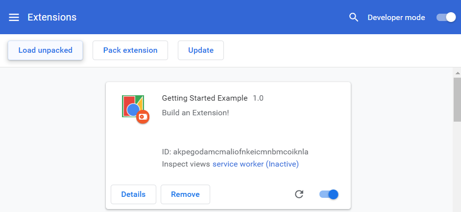

# phishing-protecter
MWScup2021 人海戦術Rubyの制作ツール

## Constructions protecting you from phishing sites
Is your PC really safe? Are you visitting bad sites?

This prevents your PC from getting caught on phishing sites by alerting.

## INSTALLATION
You download all package of "phishing-protector" and save it on an arbitrary place.  
Then you load the file to google extensions from "Load unpackaged"

## FEATURES
First, when you enter personal information, this system display warning to encourage confirmation that sites you visit is wheather legitimate or phishing

Second, if you set up option in advance, this show alert by matching contents of option and what you are typing.

Finaly, if sites you visit don't support ssl, this show alert.

## Way to Use
When you open options screen, you can check the three input forms. Important forms are "Date" and "Tag". 

Form of "Tag" have 7 elements: CreditCard, Name, Address, TelNumber, EmailAddress, Affiliation and etc.  
In "Data", You enter information about Tag that you choose.  
Then you push "Add" and it is complete.

